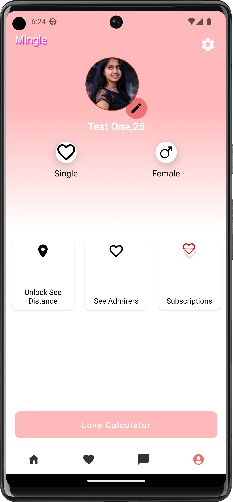

# Mingle

This is a dating application that is fully built with Jetpack compose. `NOTE:` the application is still under very heavy development and your contrubutions are welcome. Chekout the [issues]() section and help work some of the pending issues, enhancements and bugs. Feel free to also add any issues or bugs detected.

<a href='https://bit.ly/3ZXANcg'></a>

## **Instructions↗️**
To run the application you download the version present on [Playstore](https://bit.ly/3ZXANcg) or clone this project into your machine. Once you clone you'll need to connect the project to firebase and add the `google-services.json` file to this path:

```gradle
app\
    src\ 
       dev
```
`NOTE`
 To simulate the real feel of the application you'll have to create two or three accounts and select different genders and interests in the account creation process. To make this entire process easier you can use this [`google-services.json`](http://bit.ly/3ZCbtI4) that already has test users that i am using for development phase. 


I am using product flavours and have three flavours `dev` , `staging` and `production`. Once you have added the `google-services.json` file to the dev flavour variant path,
   * You have to check and confirm that you have selected the `devDebug` Build variant. To do this:
     * navigate to bottom left side of your android studio and select `Build Variants`
     * Under the :app level module select `devDebug`
     * Once gradle build is done Run the application
 
   `NOTE` You will also need to add this to your `local.properties` file. 
  
  ```gradle
  
  MAPS_API_KEY = API_KEY_HERE
  ADMOB_APP_ID = APP_ID_HERE
  BANNER_ADD_ID = "BANNER_ID_HERE"
  
  ```
     
## Contribution 🪶
To contribute to the project clone it and make your changes. Once done with making changes, on the terminal of your android studio run
   1. * ` ./gradlew spotlessApply `
   2.  * `./gradlew ktlintFormat `
   3. * `./gradlew ktlintcheck `
 
  Once the code passes all ktlint checks push the code and open a `Pull Request`
 
     
## Contributor(s) 🤝

Take a look at the contributors for this project. 😎
     
     
## **Screenshots 📷**
| | | |
|:-------------------------:|:-------------------------:|:-------------------------:|
| |  |  |
|  |   |  |
|   |  |  |

 
## **Tech stack & Libraries 🛠️👨‍💻**
 - [Kotlin](https://kotlinlang.org/docs/reference/) - Kotlin is a cross-platform, statically typed, general-purpose programming language with type inference. Kotlin is designed to interoperate fully with Java, and the JVM version of Kotlin's standard library depends on the Java Class Library, but type inference allows its syntax to be more concise
 * [Jetpack Components:](https://developer.android.com/topic/architecture?gclid=Cj0KCQjw8O-VBhCpARIsACMvVLOH1satX45o9f4PMQ4Sxr7bG9myl6-KZL9nYda8PJsHV7m2uJL8bzgaAmqiEALw_wcB&gclsrc=aw.ds)
    * [Jetpack Compose](https://developer.android.com/jetpack/compose?gclid=Cj0KCQjwhqaVBhCxARIsAHK1tiMMwHsxQ8Z25jyEdtLha9erq11wROoEfL6RqpGMprgbDTNuMO3_Ri8aAu5EEALw_wcB&gclsrc=aw.ds) -  Android’s modern toolkit for building native UI. It simplifies and accelerates UI development on Android
    * [View Model](https://developer.android.com/topic/libraries/architecture/viewmodel)-  store and manage UI-related data in a lifecycle conscious way.
    * [Lifecycle]( https://developer.android.com/topic/libraries/architecture/lifecycle) - Perform actions in response to a change in the lifecycle status of another component, such as activities and fragments.
    * [LiveData](https://developer.android.com/topic/libraries/architecture/livedata.html) - A lifecycle-aware data holder with the observer pattern
    * [Android KTX](https://developer.android.com/kotlin/ktx.html) - Android KTX is a set of Kotlin extensions that are included with Android Jetpack and other Android libraries. KTX extensions provide concise, idiomatic Kotlin to Jetpack, Android platform, and other APIs.
    * [AndroidX](https://developer.android.com/jetpack/androidx) - Major improvement to the original Android [Support Library](https://developer.android.com/topic/libraries/support-library/index), which is no longer maintained.
- [Retrofit](https://github.com/square/retrofit)- is a type-safe REST client for Android, Java and Kotlin, built as a powerful framework for consuming APIs

* [Dagger-Hilt](https://dagger.dev/hilt/)- a dependency injection library for Android that reduces the boilerplate of doing manual dependency injection in your project

* [Coroutines](https://developer.android.com/kotlin/coroutines) - a concurrency design pattern that you can use on Android to simplify code that executes asynchronously
* [Flow](https://developer.android.com/kotlin/flow)- In coroutines, a flow is a type that can emit multiple values sequentially, as opposed to suspend functions that return only a single value.
 * [Firebase](https://firebase.google.com/) - Firebase is an app development platform that helps you build and grow apps and games users love. Backed by Google and trusted by millions of businesses around the world.
    * [Realtime-database](https://firebase.google.com/products/realtime-database#:~:text=The%20Firebase%20Realtime%20Database%20is,app%20data%20at%20global%20scale.) - The Firebase Realtime Database is a cloud-hosted NoSQL database that lets you store and sync data between your users in realtime.
    * [Firestore-database](https://firebase.google.com/products/realtime-database#:~:text=The%20Firebase%20Realtime%20Database%20is,app%20data%20at%20global%20scale.) - Cloud Firestore enables you to store, sync and query app data at global scale.
    * [Firebase-storage](https://firebase.google.com/docs/storage/web/start#:~:text=Cloud%20Storage%20for%20Firebase%20lets,high%20availability%20and%20global%20redundancy.) - Cloud Storage for Firebase lets you upload and share user generated content, such as images and video, which allows you to build rich media content into your apps
    * [Fcm](https://firebase.google.com/docs/cloud-messaging) - Firebase Cloud Messaging (FCM) is a cross-platform messaging solution that lets you reliably send messages at no cost.
    * [Authentication](https://firebase.google.com/docs/auth#:~:text=Firebase%20Authentication%20provides%20backend%20services,Facebook%20and%20Twitter%2C%20and%20more.) - Firebase Authentication provides backend services, easy-to-use SDKs, and ready-made UI libraries to authenticate users to your app
    * [Crashlytics](https://firebase.google.com/docs/crashlytics) - Firebase Crashlytics is a lightweight, realtime crash reporter that helps you track, prioritize, and fix stability issues that erode your app quality. Crashlytics saves you troubleshooting time by intelligently grouping crashes and highlighting the circumstances that lead up to them.
 * [Preferences Datastore](https://developer.android.com/codelabs/android-preferences-datastore#0) - DataStore is a new and improved data storage solution aimed at replacing SharedPreferences. Built on Kotlin coroutines and Flow,
* [CI/CD](https://codemagic.io/android-continuous-integration/) - Continuous integration systems let you automatically build and test your app every time you check in updates to your source control system. 

* [Coil](https://coil-kt.github.io/coil/compose/) - Image Loader library.

 * [Compose Navigation]()
 * [Lottie Animation](https://lottiefiles.com/what-is-lottie) - A Lottie is a JSON-based animation file format that allows you to ship animations on any platform as easily as shipping static assets. 
 
 
 ## Architecture 🏚️
The application is built following a multi module approach with all features being developed as separate modules. We have the Network Module which contains the data and domain layers for alll the features and each feature contains its own presentation (ui layer).

### 1.UI layer
The role of the UI layer (or presentation layer) is to display the application data on the screen. Whenever the data changes, either due to user interaction (such as pressing a button) or external input (such as a network response), the UI should update to reflect the changes.
The UI layer is made up of two things:

* UI elements that render the data on the screen. You build these elements using Views or Jetpack Compose functions.
* State holders (such as ViewModel classes) that hold data, expose it to the UI, and handle logic.

### 2.Data layer
The data layer of an app contains the business logic. The business logic is what gives value to your app—it's made of rules that determine how your app creates, stores, and changes data.
The data layer is made of repositories that each can contain zero to many data sources. You should create a repository class for each different type of data you handle in your app.

### 3.Domain Layer
The domain layer is an optional layer that sits between the UI and data layers.
The domain layer is responsible for encapsulating complex business logic, or simple business logic that is reused by multiple ViewModels. This layer is optional because not all apps will have these requirements. You should use it only when needed—for example, to handle complexity or favor reusability

## **Modularization**


## **Author**✍️
Felix Kariuki

<a href="https://www.buymeacoffee.com/felix.kariuki" target="_blank"></a>

Do Reach Out :

  * [Twitter](https://twitter.com/felixkariuki_)

  * [LinkedIn](https://www.linkedin.com/in/felix-kariuki/)
  
  
  ## License and Copyright ©️
  
  ```
    Copyright 2023 Felix Kariuki

    Licensed under the Apache License, Version 2.0 (the "License");
    you may not use this file except in compliance with the License.
    You may obtain a copy of the License at

       http://www.apache.org/licenses/LICENSE-2.0

    Unless required by applicable law or agreed to in writing, software
    distributed under the License is distributed on an "AS IS" BASIS,
    WITHOUT WARRANTIES OR CONDITIONS OF ANY KIND, either express or implied.
    See the License for the specific language governing permissions and
    limitations under the License.
  
  ```
